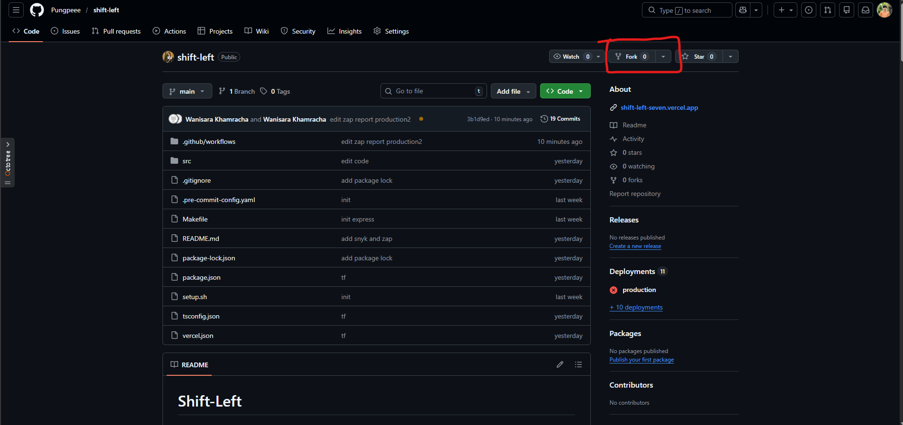
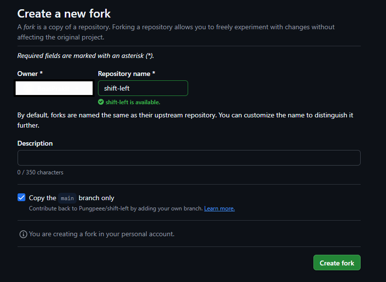

# Shift-Left

## Getting Started from Scratch

This guide will walk you through setting up this project completely from the beginning, including signing up for GitHub, forking the repository, installing dependencies, and setting up Vercel deployment.

### Step 1: Sign Up for GitHub

1. Go to [GitHub](https://github.com)
2. Click **Sign up** in the top right corner
3. Enter your email address
4. Create a strong password
5. Enter a username (e.g., `your-username`)
6. Choose whether to receive emails from GitHub
7. Complete the CAPTCHA
8. Click **Create account**
9. Verify your email address by clicking the link in the verification email GitHub sends you
10. (Optional) Customize your profile by adding a bio and profile picture

### Step 2: Fork the Repository

1. Go to the original repository on GitHub (e.g., `https://github.com/Pungpeee/shift-left`)
2. Click the **Fork** button in the top right corner

3. Select where you want to fork the repository (your personal account) and click **Create fork**

4. Wait for GitHub to complete the forking process
5. You now have your own copy of the repository at `https://github.com/your-username/shift-left`
6. Copy this forked repository URL for the next step

### Step 3: Install Prerequisites

#### macOS

1. Install Homebrew (if not already installed):
   ```bash
   /bin/bash -c "$(curl -fsSL https://raw.githubusercontent.com/Homebrew/install/HEAD/install.sh)"
   ```

2. Install Node.js (>= 18.0.0):
   ```bash
   brew install node
   ```

3. Install Git (if not already installed):
   ```bash
   brew install git
   ```

4. Verify installations:
   ```bash
   node --version
   npm --version
   git --version
   ```

#### Windows

1. Install Node.js (>= 18.0.0) from [nodejs.org](https://nodejs.org/)
   - Download the LTS version
   - Run the installer and follow the prompts
   - Accept all defaults

2. Install Git from [git-scm.com](https://git-scm.com/)
   - Download the latest version
   - Run the installer and follow the prompts
   - Accept all defaults

3. Verify installations by opening PowerShell and running:
   ```powershell
   node --version
   npm --version
   git --version
   ```

### Step 4: Clone and Initialize the Repository Locally

1. Open your terminal (macOS/Linux) or PowerShell (Windows)
2. Create a directory for your projects (if you don't have one):
   ```bash
   mkdir ~/projects
   cd ~/projects
   ```

3. Clone the repository you just created on GitHub:
   ```bash
   git clone https://github.com/your-username/shift-left.git
   cd shift-left
   ```

4. Configure Git with your GitHub credentials (if not already configured):
   ```bash
   git config --global user.name "Your Name"
   git config --global user.email "your-email@example.com"
   ```

### Step 5: Install Project Dependencies

Install all Node.js project dependencies:

```bash
npm install
```

### Step 6: Setup Pre-commit Hooks

#### macOS

Run the setup command:

```bash
make setup
```

Or run the setup script directly:

```bash
./setup.sh
```

#### Windows

Since Windows does not have `make` natively, run the setup script directly:

```powershell
./setup.sh
```

**Alternative (if using WSL2 or Git Bash):**
```bash
make setup
```

### Step 7: Configure GitHub Secrets

Before CI/CD can work, you need to set up GitHub secrets for Vercel and Snyk integration.

1. Go to your GitHub repository
2. Navigate to **Settings** > **Secrets and variables** > **Actions**
3. Add the following secrets (see "Setup Vercel" and "Setup Snyk" sections below):
   - `VERCEL_TOKEN`
   - `VERCEL_ORG_ID`
   - `VERCEL_PROJECT_ID`
   - `SNYK_TOKEN`

### Step 8: Install Vercel CLI

#### macOS

```bash
npm install -g vercel
```

Or with Homebrew:
```bash
brew install vercel-cli
```

#### Windows

```powershell
npm install -g vercel
```

Or using Chocolatey (if installed):
```powershell
choco install vercel-cli
```

### Step 9: Login to Vercel

Login to your Vercel account:

#### macOS & Windows (same command)

```bash
vercel login
```

This will open a browser window to authenticate. Follow the on-screen prompts.

### Step 10: Link Project to Vercel

Link your local project to Vercel:

```bash
vercel link
```

Follow the prompts:
1. Select **Create a new project**
2. Enter project name: `shift-left`
3. Select framework preset: **Other** (since this is a Node.js project)
4. Enter root directory: `.` (current directory)

This creates a `.vercel/project.json` file with `orgId` and `projectId`.

### Step 11: Get Vercel Credentials for GitHub Secrets

To enable automated deployment via GitHub Actions, you need your Vercel token and credentials:

#### Get Vercel Token

1. Go to [Vercel Tokens](https://vercel.com/account/tokens)
2. Click **Create New Token**
3. Name it `github-actions`
4. Copy the token and save it
5. Add it to GitHub secrets as `VERCEL_TOKEN`

#### Get Organization ID and Project ID

After running `vercel link`, view your configuration:

```bash
cat .vercel/project.json
```

You'll see:
```json
{
  "orgId": "team_xxxxxxxxxxxxxxxx",
  "projectId": "prj_xxxxxxxxxxxxxxxx"
}
```

Copy these values and add them to GitHub secrets:
- `VERCEL_ORG_ID` = the `orgId` value
- `VERCEL_PROJECT_ID` = the `projectId` value

### Step 12: Setup Snyk (Optional but Recommended)

Snyk provides security scanning for your dependencies.

1. Go to [Snyk](https://snyk.io)
2. Sign up with your GitHub account
3. Go to **Account Settings** (click your profile icon)
4. Select **API Token**
5. Click **Show** to reveal your token
6. Copy the token and add it to GitHub secrets as `SNYK_TOKEN`

### Step 13: Test the Setup

#### Run the Development Server

```bash
npm run dev
```

You should see output like:
```
Server running at http://localhost:3000
```

#### Test the API

In a new terminal:

```bash
curl http://localhost:3000/
curl http://localhost:3000/health
```

#### Run Pre-commit Hooks

Verify pre-commit is working by making a test commit:

```bash
git add README.md
pre-commit run
git commit -m "Test commit"
```

#### Build the Project

```bash
npm run build
```

## Setup

### Prerequisites

- [Homebrew](https://brew.sh/) - Package manager for macOS

### Installation

Run the setup command to install pre-commit and configure hooks:

```bash
make setup
```

Or run the setup script directly:

```bash
./setup.sh
```

### Pre-commit Hooks

This project uses pre-commit to ensure code quality. The following hooks are configured:

- **trailing-whitespace** - Removes trailing whitespace
- **end-of-file-fixer** - Ensures files end with a newline
- **check-yaml** - Validates YAML syntax
- **check-json** - Validates JSON syntax
- **check-toml** - Validates TOML syntax
- **check-merge-conflict** - Detects merge conflict markers
- **detect-private-key** - Detects private keys
- **mixed-line-ending** - Normalizes line endings to LF
### Usage

Run pre-commit on staged files:

```bash
pre-commit run
```

Skip pre-commit hooks (not recommended):

```bash
git commit --no-verify
```

## API

### Prerequisites

- [Node.js](https://nodejs.org/) - JavaScript runtime (>= 18.0.0)
- [TypeScript](https://www.typescriptlang.org/) - Typed JavaScript superset

### Installation

Install dependencies:

```bash
npm install
```

### Running the Server

Start the server in development mode (with auto-reload using ts-node):

```bash
npm run dev
```

Build the TypeScript project:

```bash
npm run build
```

Start the server in production mode (requires build first):

```bash
npm start
```

### API Endpoints

#### GET /
Welcome endpoint

```bash
curl http://localhost:3000/
```

Response:
```json
{
  "message": "Welcome to Shift-Left API",
  "version": "1.0.0"
}
```

#### GET /health
Health check endpoint

```bash
curl http://localhost:3000/health
```

Response:
```json
{
  "status": "ok"
}
```

## CI/CD

### GitHub Actions

This project uses GitHub Actions for continuous integration and deployment. The workflow is triggered on push to the `main` branch or manually via workflow dispatch.

#### Workflow Stages

1. **Build Stage**
   - Checks out the code
   - Sets up Node.js environment
   - Installs dependencies
   - Builds TypeScript application
   - Runs Snyk security scan (SAST)
   - Uploads build artifacts

2. **Deploy Stage**
   - Downloads build artifacts
   - Deploys to Vercel production environment
   - Runs OWASP ZAP scan (DAST) on deployed application
   - Uploads scan reports

#### Security Scanning

**Snyk (SAST - Static Application Security Testing)**
- Scans dependencies for known vulnerabilities
- Checks code for security issues
- Results are uploaded to GitHub Security tab
- Only allows high severity issues to pass

**OWASP ZAP (DAST - Dynamic Application Security Testing)**
- Scans the deployed application for vulnerabilities
- Tests common attack vectors (XSS, SQL injection, etc.)
- Generates HTML report available as workflow artifact

#### Required GitHub Secrets

Configure the following secrets in your GitHub repository settings (`Settings > Secrets and variables > Actions`):

| Secret | Description | How to get it |
|--------|-------------|---------------|
| `VERCEL_TOKEN` | Vercel authentication token | Go to [Vercel Tokens](https://vercel.com/account/tokens) and create a new token |
| `VERCEL_ORG_ID` | Your Vercel organization ID | Found in `.vercel/project.json` or Vercel project settings |
| `VERCEL_PROJECT_ID` | Your Vercel project ID | Found in `.vercel/project.json` or Vercel project settings |
| `SNYK_TOKEN` | Snyk authentication token | Go to [Snyk Account Settings](https://app.snyk.io/account) and generate a new API token |

#### How to get Vercel Organization ID and Project ID

**Using Vercel Dashboard**

1. Go to [Vercel Dashboard](https://vercel.com/dashboard)
2. Select your project
3. Go to **Settings** tab
4. Scroll down to **General** section
5. Copy the **Project ID** from the project information
6. For **Organization ID**, click on your profile/team name at the top left and select **Settings**, then copy the **ID** from the General section

#### Manual Deployment

You can trigger a manual deployment from the Actions tab in your GitHub repository:
1. Go to **Actions** tab
2. Select **Build and Deploy** workflow
3. Click **Run workflow**
4. Select the branch and click **Run workflow**

## Deployment

### Vercel

This project is configured for deployment on [Vercel](https://vercel.com/).


#### Deploy via Vercel Dashboard

1. Push your code to a Git repository (GitHub, GitLab, or Bitbucket)
2. Import the project in [Vercel Dashboard](https://vercel.com/new)
3. Vercel will automatically detect the configuration and deploy

#### Environment Variables

Set the following environment variable in Vercel if needed:

- `PORT` - Server port (default: 3000)
